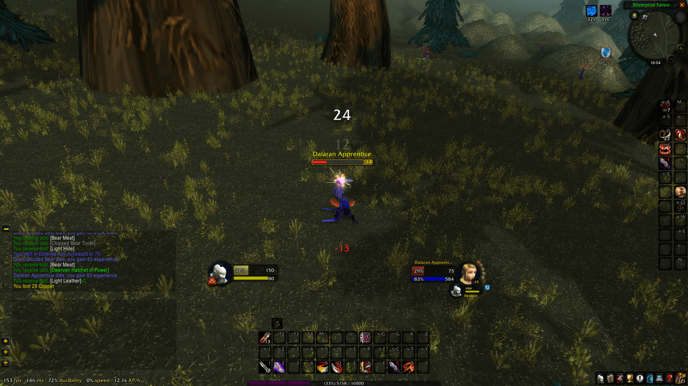

# ResistUI

> It's my own interface addon for classic WoW, inspired by LortiUI and SUI.

## Install

- Download from https://github.com/rafaberaldo/ResistUI/archive/refs/heads/master.zip
- Unzip and place at `AddOns` folder
- Remove the `-master` suffix

There's also a chat settings at `chat-cache.txt`, copy and paste
at `WTF/Account/<AccNumber>/<Realm>/<Character>` folder

## Example

## License

[GPL-3.0](https://github.com/rafaberaldo/ResistUI/blob/master/LICENSE)

Copyright (c) 2024-present, Rafael (Resist) Beraldo
